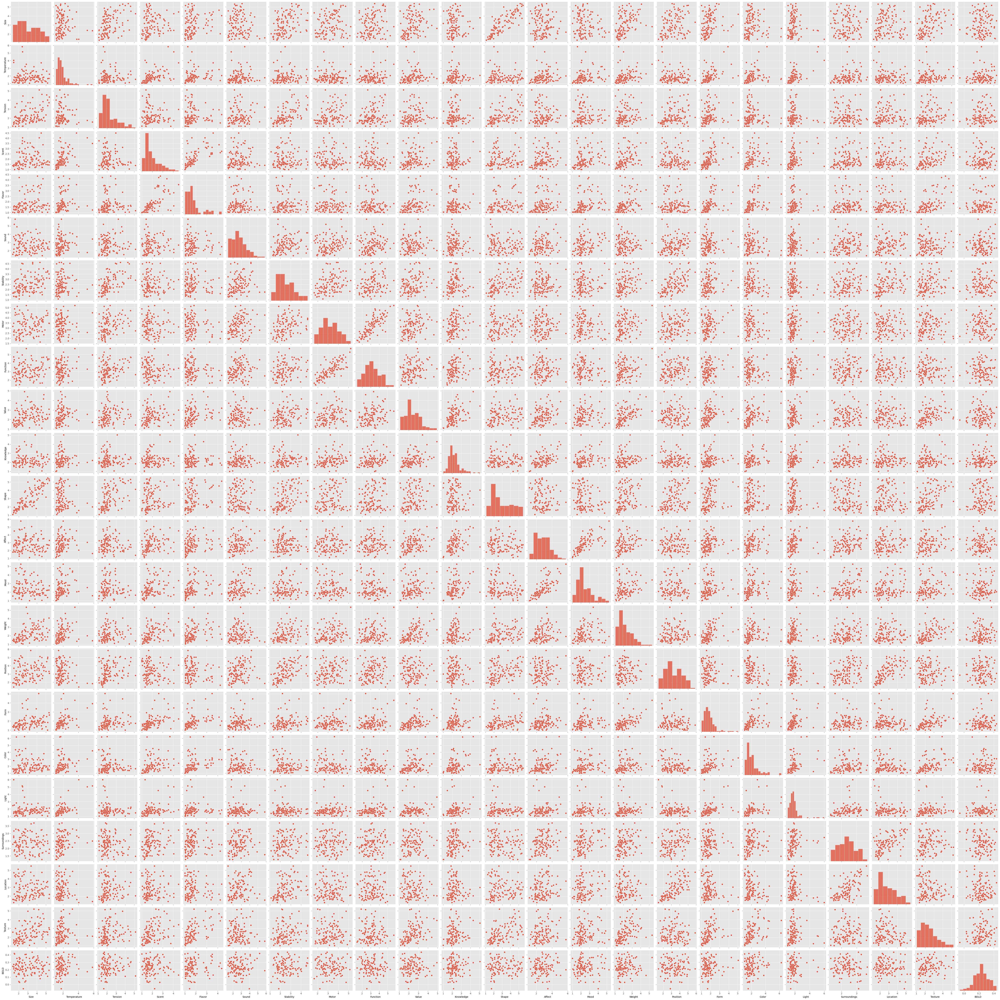
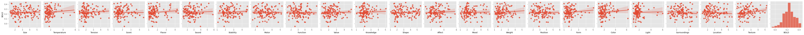
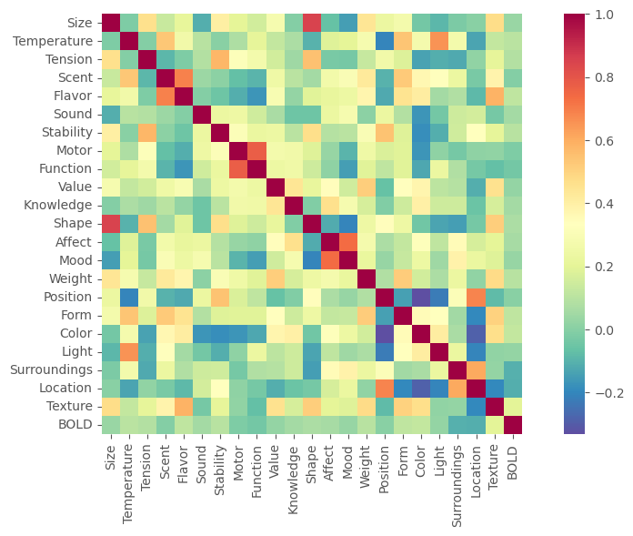
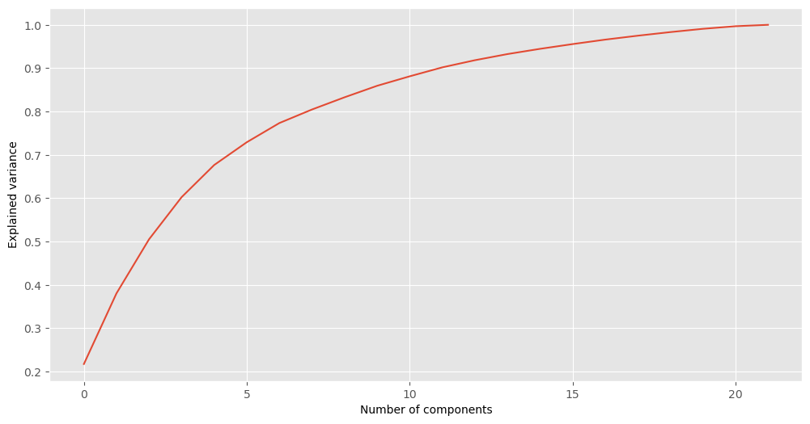
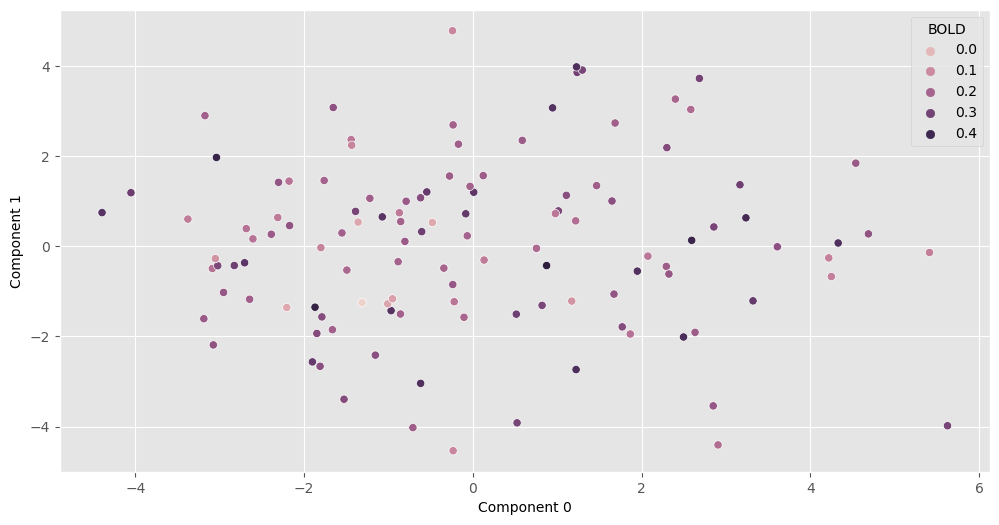
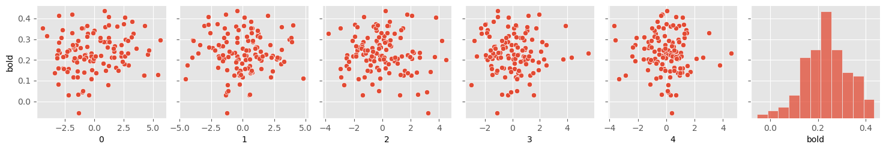
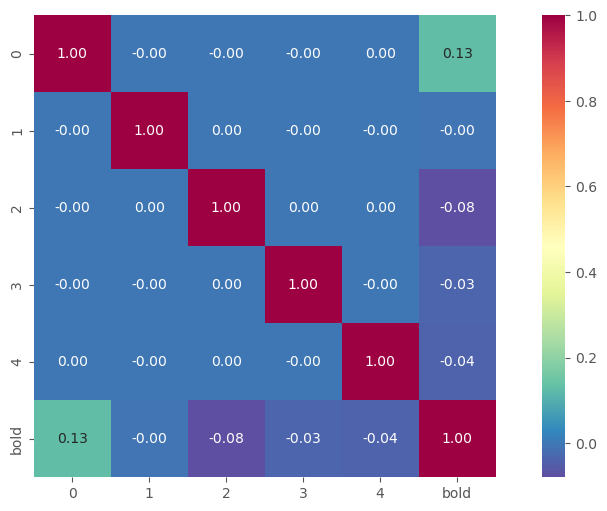
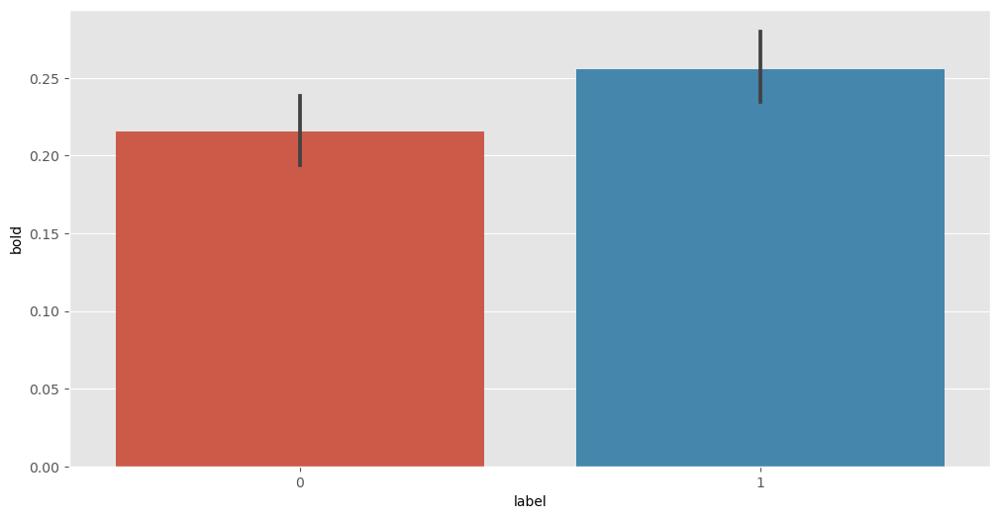
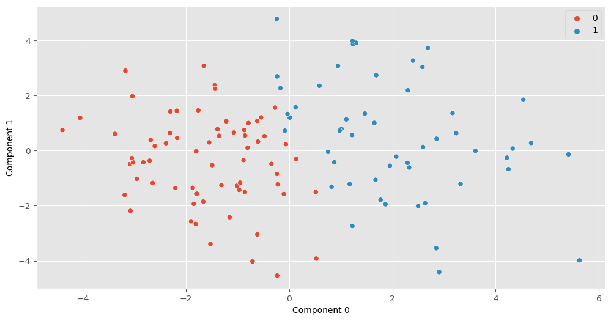

# Dimensions of change exploratory analysis 1

- In reading, Hindy et al. (2012) show a correlation between brain activation (BOLD) and the severity of the change described by each sentence. For example, a sentence describing a "cut the cake" event would likely elicit greater activitation than a "photograph the cake" event. Some events describe large physical changes (like cutting a cake) but some drastic changes could also have little corresponding physical change (like signing legal paperwork). Does the brain (and cognitive system) treat all types of change the same? What types does it care about?
- Method: Collected ratings using Qualtrics for 120 sentences describing different events. Participants rated sentences along 22 possible dimensions of change on a scale from 1-7. 
- Each row (120) contains ratings for a sentence.
- Ratings of change along 22 different dimensions & BOLD values from Hindy et al. (2012).


```python
import os
import pandas as pd
import numpy as np
import matplotlib.pyplot as plt
from matplotlib import rcParams
import seaborn as sns

plt.style.use("ggplot")

data = pd.read_csv('data.csv')
data = data.drop(columns=['Question','QuestForCorr'])
data = data.rename(columns={'1: Size':'Size','10: Temperature': 'Temperature','11: Tension':'Tension','12: Scent':'Scent',
                   '13: Flavor':'Flavor','14: Sound':'Sound','15: Stability':'Stability','16: Motoric_interaction':'Motor',
                   '17: Function':'Function','18: Value':'Value','19: Knowledge':'Knowledge','2: Shape':'Shape',
                   '20: Emotional_affect':'Affect','21: Mood':'Mood','22: Weight':'Weight','3: Position':'Position',
                   '4: Form':'Form','5: Color':'Color','6: Light':'Light','7: Surroundings':'Surroundings',
                   '8: Location':'Location','9: Texture':'Texture','Bold':'BOLD'})

bold = data['BOLD']
feats = data.drop(columns='BOLD')
feature_names = np.array(list(feats.columns.values))

sns.pairplot(data)
plt.show()
```


    

    


Some of the distributions are a fairly skewed (e.g. light), but nothing too crazy. As a first step, see if any of the new dimensions already have an obvious relationship to BOLD based on the scatterplots (below). Some look potentially positively correlated (e.g. texture). I'm return back to this with linear models later.


```python
sns.pairplot(data,y_vars=['BOLD'],kind='reg')
plt.show()
```


    

    


```python
data_corrmat = data.corr()
originalhm = sns.heatmap(data_corrmat, 
                 cbar=True, 
                 annot=False, 
                 square=True, 
                 fmt='.2f', 
                 annot_kws={'size': 10}, 
                 yticklabels=data_corrmat.columns, 
                 xticklabels=data_corrmat.columns, 
                 cmap="Spectral_r")
```


    

    


```python
from sklearn.preprocessing import StandardScaler

scaler = StandardScaler()
scaler.fit(feats)
feats_scaled = scaler.transform(feats)
```

# PCA
- Including only these new dimensions (no BOLD), I ran a PCA to see if any of the new dimensions could be reduced down in an unsupervised way (e.g. physical types of pattern similarly). Analysis of this PCA shows that it takes quite a few components to explain most of the variation (11 components to explain about 90% of the original variance). We are explaining quite a bit of variation in the first few however, so we do seem to be getting at some underlying similarity. 


```python
from sklearn.decomposition import PCA

pca_all = PCA()
pca_all.fit(feats_scaled)
feats_pca_all = pca_all.transform(feats_scaled)

np.cumsum(pca_all.explained_variance_ratio_ * 100)

plt.plot(np.cumsum(pca_all.explained_variance_ratio_))
plt.xlabel('Number of components')
plt.ylabel('Explained variance')
```


    Text(0, 0.5, 'Explained variance')


    

    


# PCA Stats
- Let's see if any of the variation we're picking up with any of these components naturally maps on to the BOLD signal. From the scatterplot of components 0 and 1, nothing seemed obvious to me at first glance. In the correlation matrix below we can see a small positive correlation between component 0 and BOLD (r=0.13,p=0.16), however it's not significant.
- Considering the PCA was trained without any reference to the BOLD signal, it is interesting to note this correlation with component 0, even though it's not significant. Beyond that suggestive finding, nothing obvious is coming out from this analysis.


```python
pca_2 = PCA(n_components=2)
pca_2.fit(feats_scaled)
feats_pca_2 = pca_2.transform(feats_scaled)

sns.scatterplot(x=feats_pca_2[:,0],y=feats_pca_2[:,1], hue = bold)
plt.xlabel('Component 0')
plt.ylabel('Component 1')
```


    Text(0, 0.5, 'Component 1')


    

    


```python
pca_5 = PCA(n_components=5)
pca_5.fit(feats_scaled)
feats_pca_5 = pca_5.transform(feats_scaled)

corr_df = pd.DataFrame(feats_pca_5)
corr_df['bold'] = bold

sns.pairplot(corr_df, y_vars=['bold'])
plt.show()
```


    

    


```python
corr_df_corrmat = corr_df.corr()
corr_dfhm = sns.heatmap(corr_df_corrmat, 
                 cbar=True, 
                 annot=True, 
                 square=True, 
                 fmt='.2f', 
                 annot_kws={'size': 10}, 
                 yticklabels=corr_df_corrmat.columns, 
                 xticklabels=corr_df_corrmat.columns, 
                 cmap="Spectral_r")
```


    

    


```python
from scipy import stats
corr_df = corr_df.set_axis(['C0', 'C1', 'C2', 'C3', 'C4', 'bold'], axis=1)
stats.pearsonr(corr_df['C0'], corr_df['bold'])
```


    PearsonRResult(statistic=0.1301496933986265, pvalue=0.15653277355877773)


# K-means clustering
- Here I'm going to try a k-means clustering algorithm to see if any obvious groupings emerge in the new 22 dimensions. Here the algorithm was made to generate 2 clusters with the 120 items. I then took the labels generated by the clustering algorithm and compared BOLD ratings across these groups. We do show significantly higher BOLD activation for items in the label 2 group (t=-2.42, p=0.02) compared to label 1. This result is suggestive that it would be worthwhile to explore those clusters. 


```python
from sklearn.cluster import KMeans
kmeans = KMeans(n_clusters=2, n_init="auto").fit(feats_scaled)
cluster_labels=kmeans.labels_

clust_df = pd.DataFrame(list(zip(cluster_labels,bold)),columns=['label','bold'])
clust_df.head()
```


<div>
<table border="1" class="dataframe">
  <thead>
    <tr style="text-align: right;">
      <th></th>
      <th>label</th>
      <th>bold</th>
    </tr>
  </thead>
  <tbody>
    <tr>
      <th>0</th>
      <td>0</td>
      <td>0.158420</td>
    </tr>
    <tr>
      <th>1</th>
      <td>0</td>
      <td>0.139889</td>
    </tr>
    <tr>
      <th>2</th>
      <td>0</td>
      <td>0.136315</td>
    </tr>
    <tr>
      <th>3</th>
      <td>0</td>
      <td>0.328171</td>
    </tr>
    <tr>
      <th>4</th>
      <td>1</td>
      <td>0.079750</td>
    </tr>
  </tbody>
</table>
</div>


```python
lab1 = clust_df[clust_df["label"] == 0]
lab2 = clust_df[clust_df["label"] == 1]

from scipy import stats
import seaborn as sns

sns.barplot(data=clust_df, x="label", y="bold", errorbar = "ci")
```


    <Axes: xlabel='label', ylabel='bold'>


    

    


```python
stats.ttest_ind(lab1['bold'], lab2['bold'], equal_var=False)
```


    Ttest_indResult(statistic=-2.4161748032734796, pvalue=0.017242447875660743)


Interestingly the boundary between group 1 and 2 generated by the k-means algorithm can actually be seen clearly on a graph, bisected along component 0 generated by the PCA. This leads me to think that the variation we were getting at with the PCA was likely approximating a general "change" rating average regardless of dimension. This clustering algorithm seems to be getting at a similar thing, but probably more reliably based on the results of the t-test. Component 0 does seem worth investigating, both because of the small correaltion and also because it bisects the clusters. To do this I extracted the weights from component 0, where dimensions with higher weightings are be more influential in determining the component.


```python
sns.scatterplot(x=feats_pca_2[:,0],y=feats_pca_2[:,1], hue = cluster_labels)
plt.xlabel('Component 0')
plt.ylabel('Component 1')
```


    Text(0, 0.5, 'Component 1')


    

    


```python
weights = pca_2.components_
weights = pd.DataFrame(weights, columns=feats.columns)
weights['Component'] = [0,1]
weights.head()

```


<div>
<table border="1" class="dataframe">
  <thead>
    <tr style="text-align: right;">
      <th></th>
      <th>Size</th>
      <th>Temperature</th>
      <th>Tension</th>
      <th>Scent</th>
      <th>Flavor</th>
      <th>Sound</th>
      <th>Stability</th>
      <th>Motor</th>
      <th>Function</th>
      <th>Value</th>
      <th>...</th>
      <th>Mood</th>
      <th>Weight</th>
      <th>Position</th>
      <th>Form</th>
      <th>Color</th>
      <th>Light</th>
      <th>Surroundings</th>
      <th>Location</th>
      <th>Texture</th>
      <th>Component</th>
    </tr>
  </thead>
  <tbody>
    <tr>
      <th>0</th>
      <td>0.216417</td>
      <td>0.232576</td>
      <td>0.127852</td>
      <td>0.299143</td>
      <td>0.281296</td>
      <td>0.051387</td>
      <td>0.163438</td>
      <td>0.121549</td>
      <td>0.111921</td>
      <td>0.300742</td>
      <td>...</td>
      <td>0.176664</td>
      <td>0.328324</td>
      <td>0.007759</td>
      <td>0.334072</td>
      <td>0.231422</td>
      <td>0.151465</td>
      <td>0.126518</td>
      <td>-0.029067</td>
      <td>0.328114</td>
      <td>0</td>
    </tr>
    <tr>
      <th>1</th>
      <td>0.304910</td>
      <td>-0.190712</td>
      <td>0.338464</td>
      <td>-0.190889</td>
      <td>-0.144236</td>
      <td>0.088355</td>
      <td>0.365491</td>
      <td>0.255649</td>
      <td>0.200066</td>
      <td>0.027591</td>
      <td>...</td>
      <td>-0.142056</td>
      <td>0.067311</td>
      <td>0.349728</td>
      <td>-0.051225</td>
      <td>-0.289752</td>
      <td>-0.222518</td>
      <td>-0.025413</td>
      <td>0.186268</td>
      <td>0.010738</td>
      <td>1</td>
    </tr>
  </tbody>
</table>
<p>2 rows × 23 columns</p>
</div>


```python
melted = weights.melt(id_vars=['Component'], var_name='Dimension', value_name='Weights')
melted.sort_values(by=['Component', 'Weights'], ascending= [True, False], inplace = True)

melted.head()
#melted.to_csv("PCAWeights.csv")
```


<div>
<table border="1" class="dataframe">
  <thead>
    <tr style="text-align: right;">
      <th></th>
      <th>Component</th>
      <th>Dimension</th>
      <th>Weights</th>
    </tr>
  </thead>
  <tbody>
    <tr>
      <th>32</th>
      <td>0</td>
      <td>Form</td>
      <td>0.334072</td>
    </tr>
    <tr>
      <th>28</th>
      <td>0</td>
      <td>Weight</td>
      <td>0.328324</td>
    </tr>
    <tr>
      <th>42</th>
      <td>0</td>
      <td>Texture</td>
      <td>0.328114</td>
    </tr>
    <tr>
      <th>18</th>
      <td>0</td>
      <td>Value</td>
      <td>0.300742</td>
    </tr>
    <tr>
      <th>6</th>
      <td>0</td>
      <td>Scent</td>
      <td>0.299143</td>
    </tr>
  </tbody>
</table>
</div>


# Initial Takeaway
The k-means clustering seems useful for describing BOLD based on sentence feeatures, however I'm curious the extent to which it is just approximating a split along a general change rating. Component 0 does correlate decently with bold and also bisects the k-means clusters. The dimensions of Form, Weight, and Texture have the highest weights, and intuitively do all seem to be related to physical characteristics. This suggests that BOLD is likely particularly sensitive to changes along these physical dimensions. Value, however, has the 4th highest weight for component 0. This is a much more abstract feature than the previous physical ones, but it likely does have a strong attentional component (e.g. losing a very valuable lottery ticket has very little physical change but would likely draw a large amount of focus). This reaffirms the importance of physical, visual change, and also leaves me more curious about the role of attention and it's relationship to these change ratings. For next steps I'm going to do some feature importance tests of these dimensions, but in another document.
