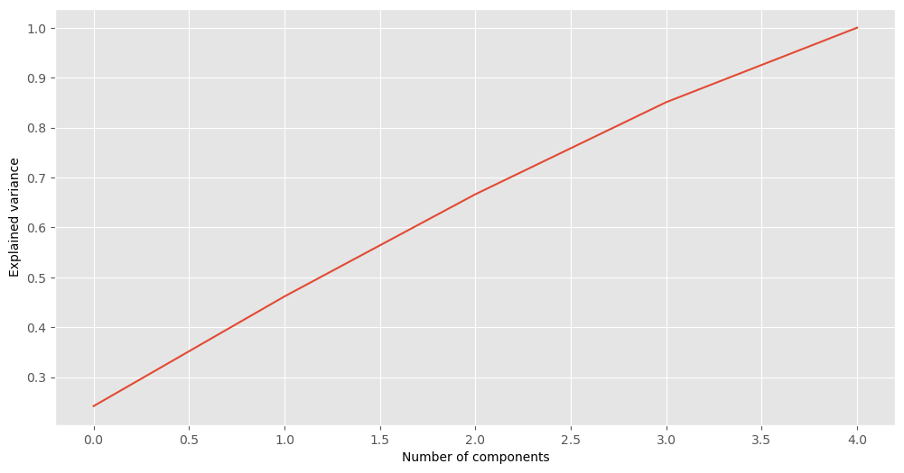
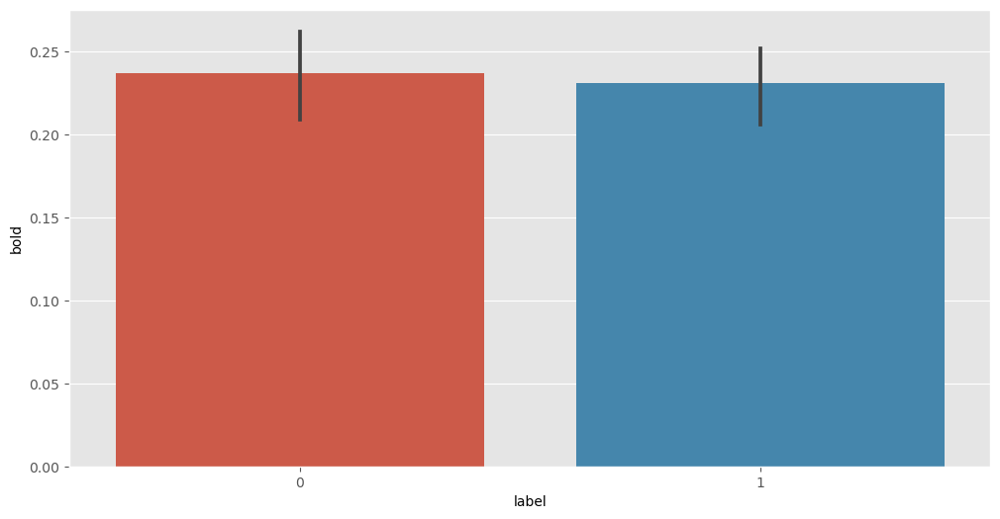
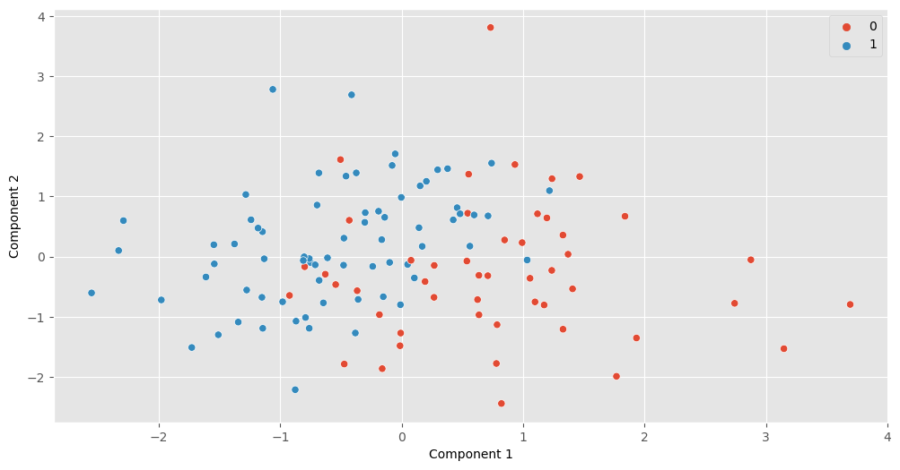

In the main readme, I describe a k-means clustering algorithm which we used to generate 2 clusters based on the collected 22 dimensions. Based on those cluster labels, I then conducted a t-test comparing BOLD responses between the groups. We show a significant difference between those two groups, even the BOLD signal was not used in the clustering. 

In order to ensure that this difference isn't an artifact of the algorithms I used, I am replicating the same analysis with 5 new features (random normal distributions) and the same BOLD response.


```python
#!/usr/bin/env python3
# -*- coding: utf-8 -*-
"""
Created on Fri Jul 14 19:50:16 2023

@author: ekves
"""
import os
import pandas as pd
import numpy as np
import matplotlib.pyplot as plt
from matplotlib import rcParams
import seaborn as sns

plt.style.use("ggplot")
rcParams['figure.figsize'] = (12, 6)

data = pd.read_csv('data.csv')
data = data.drop(columns=['Question','QuestForCorr'])
data = data.rename(columns={'1: Size':'Size','10: Temperature': 'Temperature','11: Tension':'Tension','12: Scent':'Scent',
                   '13: Flavor':'Flavor','14: Sound':'Sound','15: Stability':'Stability','16: Motoric_interaction':'Motor',
                   '17: Function':'Function','18: Value':'Value','19: Knowledge':'Knowledge','2: Shape':'Shape',
                   '20: Emotional_affect':'Affect','21: Mood':'Mood','22: Weight':'Weight','3: Position':'Position',
                   '4: Form':'Form','5: Color':'Color','6: Light':'Light','7: Surroundings':'Surroundings',
                   '8: Location':'Location','9: Texture':'Texture','Bold':'BOLD'})

bold = data['BOLD']
feats = data.drop(columns='BOLD')
```

Here I make the 5 distributions and combine them into one dataframe.


```python
s1 = np.random.normal(0, 1, 120)
s2 = np.random.normal(0, 1, 120)
s3 = np.random.normal(0, 1, 120)
s4 = np.random.normal(0, 1, 120)
s5 = np.random.normal(0, 1, 120)

df = pd.DataFrame()
df['S1'] = pd.Series(s1)
df['S2'] = pd.Series(s2)
df['S3'] = pd.Series(s3)
df['S4'] = pd.Series(s4)
df['S5'] = pd.Series(s5)

df.head()
```


<div>
<table border="1" class="dataframe">
  <thead>
    <tr style="text-align: right;">
      <th></th>
      <th>S1</th>
      <th>S2</th>
      <th>S3</th>
      <th>S4</th>
      <th>S5</th>
    </tr>
  </thead>
  <tbody>
    <tr>
      <th>0</th>
      <td>-0.807689</td>
      <td>0.084452</td>
      <td>0.609208</td>
      <td>0.282537</td>
      <td>0.110326</td>
    </tr>
    <tr>
      <th>1</th>
      <td>-1.472164</td>
      <td>1.385322</td>
      <td>-0.325257</td>
      <td>-0.027243</td>
      <td>-0.710559</td>
    </tr>
    <tr>
      <th>2</th>
      <td>-0.339765</td>
      <td>0.489429</td>
      <td>-1.341612</td>
      <td>-1.362293</td>
      <td>-0.237088</td>
    </tr>
    <tr>
      <th>3</th>
      <td>0.534163</td>
      <td>-0.800316</td>
      <td>0.026557</td>
      <td>-0.509523</td>
      <td>1.091084</td>
    </tr>
    <tr>
      <th>4</th>
      <td>-1.807335</td>
      <td>1.023471</td>
      <td>0.088756</td>
      <td>1.006220</td>
      <td>0.784237</td>
    </tr>
  </tbody>
</table>
</div>


```python
from sklearn.preprocessing import StandardScaler

scaler = StandardScaler()
scaler.fit(df)
feats_scaled = scaler.transform(df)

from sklearn.decomposition import PCA

pca_all = PCA()
pca_all.fit(feats_scaled)
feats_pca_all = pca_all.transform(feats_scaled)

np.cumsum(pca_all.explained_variance_ratio_ * 100)

plt.plot(np.cumsum(pca_all.explained_variance_ratio_))
plt.xlabel('Number of components')
plt.ylabel('Explained variance')

```


    Text(0, 0.5, 'Explained variance')


    

    


We aren't explaining much variance with our PCA, which makes sense because there is no similarlity in the underlying distributions.


```python
pca_2 = PCA(n_components=2)
pca_2.fit(feats_scaled)
feats_pca_2 = pca_2.transform(feats_scaled)

from sklearn.cluster import KMeans
kmeans = KMeans(n_clusters=2, n_init="auto").fit(feats_scaled)
cluster_labels=kmeans.labels_

clust_df = pd.DataFrame(list(zip(cluster_labels,bold)),columns=['label','bold'])
clust_df["label"].describe()
clust_df["bold"].describe()

lab1 = clust_df[clust_df["label"] == 0]
lab2 = clust_df[clust_df["label"] == 1]

from scipy import stats
import seaborn as sns

stats.ttest_ind(lab1['bold'], lab2['bold'], equal_var=False)
```


    Ttest_indResult(statistic=0.33960102258527647, pvalue=0.73487642408072)


A t-test shows no difference between the groups here. I did not use any particular seed for the randomization, so there is going to be some variation if you run the code yourself. In 5 attempts, I did not observe any significant differences, though more tests would be useful to be sure.


```python
sns.barplot(data=clust_df, x="label", y="bold")
```


    <Axes: xlabel='label', ylabel='bold'>


    

    


```python
sns.scatterplot(x=feats_pca_2[:,0],y=feats_pca_2[:,1], hue = cluster_labels)
plt.xlabel('Component 1')
plt.ylabel('Component 2')
```


    Text(0, 0.5, 'Component 2')


    

    


Based on these findings, the results of the experimental t-test do seem to warrant further investigation.
